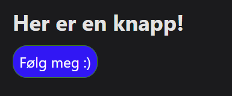

# Fintech Krasjkurs

## Litt om kurset. 
Kurset strekker seg over tre timer og består av 6 deler. Vi vil ta for oss det grunnleggende i HTML og CSS. Videre begynner vi på MarkDown språket og hvordan vi skal bygge en profesjonell nettside ved bruk av denne teknologien. Deretter blir det litt orientering om hvordan vi skal få det til med utvikling av algoritme, og sette sammen en "kjerne" som har hovedfokus på det. Dere skal så få prøve dere på det dere har lært gjennom et lite prosjekt før vi avslutter med litt oppsummering og avtaler neste møte. 

>Liten _fun fact_, dette dokumentet du nå leser er skrevet i MarkDown. 

## Før kursstart. 

1. Last ned [VS-Code](https://code.visualstudio.com/), dersom du ikke allerede har gjort det. 
    > Dersom du får til, last også ned _Live Server_ utvidelsen. Blir event gitt instrukser på kursdagen. 

2. Lag bruker på [github.com](https://github.com/) om du ikke allerede har det.

3. Følg [meg](https://github.com/nathsten) på GitHub. 

4. Last ned [node.js](https://nodejs.org/en/). **MERK:** last ned _LTS_ versjonen. 

5. Se [denne](https://www.youtube.com/watch?v=UB1O30fR-EE&t=2957s&ab_channel=TraversyMedia) videoen, for en introduksjon i HTML.

    **MERK** Det er ikke nødvendig å se hele veldig detaljert, det viktigste er å få en innføring i hva HTML er, og hvordan syntaxen ser ut. 

6. Se gjennom [denne](https://www.youtube.com/watch?v=HUBNt18RFbo&ab_channel=TraversyMedia) videoen, for en innføring i markdown. 

<br>

# Krasjkurs.

Kurset består av følgende deler. 

### **Del 1. Installering og oppsett.** 

1. Laste ned [git](https://git-scm.com/downloads) og log inn med deres nye bruker. Instrukser vil bli gitt på kurset.

    ````
    git login
    ````

    Følg prosessen. 

2. Klone [dette](https://github.com/nathsten/fintech-krasjkurs) github repoet. 

    Instrukser vil bli gitt på kurset. 

    ````
    cd ./<min mappe>
    ````

    ````
    git clone https://github.com/nathsten/fintech-krasjkurs
    ````

### **Del 2. Hva er HTML, CSS og MarkDown?**

1. Hva er HTML?

    Referer til [videoen om HTML](https://www.youtube.com/watch?v=UB1O30fR-EE&t=2957s&ab_channel=TraversyMedia). 

2. Hva er CSS og hvordan brukes det?

    Intro til CSS syntax, og hvordan det skal brukes. 

3. Hva er MarkDown?

    Bygger videre på HTML og [videoen om MarkDown](https://www.youtube.com/watch?v=HUBNt18RFbo&ab_channel=TraversyMedia).

    Dette er noe av det mest sentrale i hele kurset. 

4. Hva er React?

    Generell gjennomgang av hva React er.

    Hvordan det skal brukes. 

    Hvordan React og Markdown brukes sammen, og hvorfor det er så gode venner. 

        .md => .mdx

    Eksempel på .mdx:

    ````javascript
        // Her lager jeg et element som lager en knapp som linker til den urlen som blir sent inn. 
        // Den får så "stilen" som er bestemt i CSS filen (styles.myButton). 
        // children er den teksten som står i mellom <...>Her</...>. 
        export const Button = ({children, url}) => {
            return (
                <a href={url} className={styles.myButton}>
                    {children}
                </a>
            );
        }

        // Her bruker jeg elementet til å faktisk vise knappen på siden:

        ## Her er en knapp!
        <Button url="https://github.com/nathsten">Følg meg :)</Button>
    ````

    Dette vil da bli seende slik på på en side:

    

    CSSen til knappen ser slik ut:

    ````CSS
    .myButton{
        transition: 250ms;
        background-color: blue;
        border: green 1px solid;
        border-radius: 1rem;
        padding: 0.4rem;
        color: white;
        text-decoration: none;
    }
    ````

    Ikke stress at dette er **helt** uforståelig, det vil bli gitt grunnleggende introduksjon til hva alt dette betyr. Prøv likevel å forstå så mye som du klarer med de kunnskapene du har ;)

### **Del 3. Bli kjent med mappe -og filstrukturen.**

1. Begynne med å starte programmet.

    ````
    npm run start
    ````

2. Hva ligger i ````./docs```` og hva er det som skal ligge her?

3. Hva ligger i ````./blog```` og hva skal ligge her?

4. Hva ligger i ````./src````?

    ````./src/pages```` - sider på nettsiden

    ````./src/css```` - CSS

5. Hva er ````sidebars.js```` og hva er det her som er så viktig?

6. Hva ligger i ````docusaurus.config.js```` og hva er sentralt her?

7. Lage en ny side under `/Om oss`.

8. Skrive en blog post. 

### **Del 4. Orientering om Algoritmeutviklingen.** 

> Dette er et veldig åpent prosjekt, og det er opp til en hver enkelt til hva en ønsker å forelså. 

> Grunnleggende python programmering kommer veldig nyttig. Så sørg for å jobbe med det først før dere hopper på tradingalgoritme :)


**Viktige nøkkelord**
* > Funksjoner og klasser. 

* > `for` og `while` loops.

* > `api` - get og post requests. 

* > `json` filformatet. 

* > Python biblioteker.

* > Packagemanageren `pip`. 

**Forslag til algoritme:**

* >Tradisjonell Tradingbot. 

* >Twitter analyse bot. 

* >Machine Learning aksjepris forutsetter. 

**Intro til [Alpaca Markets](https://alpaca.markets/docs/api-references/trading-api/).**

* Hvordan det brukes og hva som må gjøres i forkant. 

* Se egen [mappe](https://github.com/nathsten/fintech-krasjkurs/tree/main/algo) for mer detaljert beskrivelse av oppsett av trading algoritme

### **Del 5. Prosjektoppgave.** 

Enten indiviuelt eller i grupper.

Jobbe på egenhånd med det vi har lært. 

Info om hva dette går ut på kommer på selvekursdagen. 

Tips til nøkkelord å ta med i søket for hjelp på nett:

> Docusaurus

> React

> mdx

>React element with mdx


### **Del 6. Oppsummering.**

Hva har vi lært?

Hvordan går vi videre fra dette?

> Hint: Jobbe med det selv og i grupper. 

> Husk at google er din beste venn :)

Mer info til prosjektoppgaven. 

Avtaler neste gang vi møtes. 

Vel møtt :)